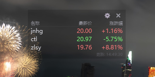

<div align="center">

# 📈 盯盘助手 · Ashare Watch Helper

**桌面悬浮的极简 A 股盯盘小工具 / A lightweight floating A-share stock ticker**

[](https://github.com/Easter127/ashare-watch-helper/releases)
[](LICENSE)
[](#-系统要求)
[](https://www.python.org/)
[](https://www.riverbankcomputing.com/software/pyqt/)

[English](#english) · [中文](#中文)

---



</div>

---

# 中文

## ✨ 这是什么

**盯盘助手** 是一个轻量级的桌面悬浮股票盯盘工具，专为 A 股设计：

- 🪟 **完全透明背景** — 0% 也能清晰阅读文字
- 🎨 **9 种颜色全可自定义** — 涨绿/跌红（中国 A 股习惯）
- ⌨️ **可自定义全局快捷键** — 默认 `Alt+E`
- 🔄 **新浪 + 腾讯双数据源** — 自动重试
- 📌 **窗口置顶 / 自由拖动**
- 🖥️ **系统托盘 + 双击恢复**
- 💾 **配置实时保存**
- 🇨🇳 **完整支持中文路径和中文 alias**
- 📦 **单文件 exe，绿色无依赖**

## 📸 预览


| 半透明背景 | 完全透明（仅文字） |
| :---: | :---: |
| 半透明深色背景，文字清晰可读 | 0% 透明度，只剩文字悬浮桌面 |

## 📥 下载

> 推荐普通用户直接下载 exe，**无需安装 Python**。

### 最新版 (v1.0.0)

| 平台 | 文件 | 大小 |
| :--- | :--- | :---: |
| 🪟 Windows (x64) | [**ashare-watch-helper.exe**](https://github.com/Easter127/ashare-watch-helper/releases/latest/download/ashare-watch-helper.exe) | ~42 MB |
| 🐧 Linux / 🍎 macOS | 需要自行 `pip install` + 运行 `.py` | — |

> 📌 点击文件名称即可下载。下载后**双击运行**，首次启动会在 exe 旁边生成 `monitor_config.json`。
>
> 💡 Windows Defender 首次可能误报，添加信任即可。

## 🚀 快速开始

### 方式一：直接用 exe（推荐）

1. 从上方 [📥 下载](#-下载) 下载 exe
2. 放到任意目录（支持中文路径）
3. 双击运行
4. 配置自动保存在 exe 旁边的 `monitor_config.json`

### 方式二：从源码运行

```bash
git clone https://github.com/Easter127/ashare-watch-helper.git
cd ashare-watch-helper
pip install -r requirements.txt
python src/stock_desktop.py
```

## ⚙️ 配置

所有配置保存在 `monitor_config.json`（首次自动生成）。配置项：

| 字段 | 说明 | 默认 |
|---|---|---|
| `stocks[].code` | 6 位 A 股代码 | `600519` 贵州茅台 |
| `stocks[].alias` | 显示别名 | `贵州茅台` |
| `refresh_interval` | 刷新间隔（毫秒） | `500` |
| `window.opacity` | 背景不透明度 | `0.0` |
| `window.font_family` | 字体 | `Microsoft YaHei` |
| `window.font_size` | 字号 | `9` |
| `window.theme` | `dark` / `light` | `dark` |
| `window.hotkey` | pynput 格式热键 | `<alt>+e` |
| `colors.{theme}.{key}` | 颜色覆盖 | （无） |

可覆盖颜色键：`text` `price` `header` `time` `sep` `up` `down` `bg` `border`

## 🎮 使用

| 操作 | 方法 |
|---|---|
| 移动窗口 | 鼠标按住任意位置拖动 |
| 显示/隐藏 | `Alt+E`（可自定义） |
| 打开设置 | 右上角 ⚙ |
| 隐藏到托盘 | `Esc` 或 ✕ |
| 恢复显示 | 双击托盘图标 |

## 🏗️ 自行打包

```bash
pip install -r requirements-dev.txt
python build_exe.py
```

输出：`dist/ashare-watch-helper.exe`（~42 MB 单文件）

## 🐛 常见问题

**Q: Alt+E 不响应？**
A: 部分安全软件会拦截 pynput 全局钩子。打开设置 → 快捷键，换成 `Ctrl+Shift+Q` 等不冲突组合。

**Q: 数据刷新失败？**
A: 检查网络。状态栏离线时会显示 ◌。

**Q: 想多只股票？**
A: 设置 → 股票列表 → 添加（如 `000001` 平安银行 / `300750` 宁德时代）。

**Q: exe 启动时杀毒误报？**
A: PyInstaller 打包偶尔被启发式扫描误报，是已知问题。添加信任或改用源码运行。

## 🤝 贡献

欢迎 PR！详见 [CONTRIBUTING.md](CONTRIBUTING.md)。

## 📜 许可证

[MIT](LICENSE) © 2024 ashare-watch-helper contributors

---

# English

## ✨ What is this

**Ashare Watch Helper** is a lightweight floating desktop stock ticker designed for A-shares (China stock market):

- 🪟 **Fully transparent background** — even at 0% text remains crisp
- 🎨 **9 colors fully customizable** — red-up / green-down (A-share convention)
- ⌨️ **Customizable global hotkey** — defaults to `Alt+E`
- 🔄 **Sina + Tencent dual data source** — auto-retry
- 📌 **Always-on-top / freely draggable**
- 🖥️ **System tray / double-click to restore**
- 💾 **Config saved in real time**
- 🇨🇳 **Full Chinese path & alias support**
- 📦 **Single-file exe, zero dependencies**

## 📸 Preview


## 📥 Download

> Most users should grab the prebuilt exe. **No Python required.**

### Latest release (v1.0.0)

| Platform | File | Size |
| :--- | :--- | :---: |
| 🪟 Windows (x64) | [**ashare-watch-helper.exe**](https://github.com/Easter127/ashare-watch-helper/releases/latest/download/ashare-watch-helper.exe) | ~42 MB |
| 🐧 Linux / 🍎 macOS | Run from source: `pip install` + `python src/stock_desktop.py` | — |

> 📌 Click the filename to download. After downloading, **double-click to run**. On first launch, `monitor_config.json` will be created next to the exe.

## 🚀 Quick Start

### Option 1: Prebuilt exe (recommended)

1. Download the exe from [📥 Download](#-download) above
2. Place it anywhere (Chinese paths supported)
3. Double-click to run
4. Config is auto-saved next to the exe as `monitor_config.json`

### Option 2: From source

```bash
git clone https://github.com/Easter127/ashare-watch-helper.git
cd ashare-watch-helper
pip install -r requirements.txt
python src/stock_desktop.py
```

## ⚙️ Configuration

All settings are stored in `monitor_config.json` (auto-generated on first run). Key fields:

| Field | Description | Default |
|---|---|---|
| `stocks[].code` | 6-digit A-share code | `600519` (Kweichow Moutai) |
| `stocks[].alias` | Display alias | `贵州茅台` |
| `refresh_interval` | Refresh interval (ms) | `500` |
| `window.opacity` | Background opacity | `0.0` |
| `window.font_family` | Font family | `Microsoft YaHei` |
| `window.font_size` | Font size | `9` |
| `window.theme` | `dark` / `light` | `dark` |
| `window.hotkey` | Hotkey (pynput format) | `<alt>+e` |
| `colors.{theme}.{key}` | Color overrides | (none) |

Color override keys: `text` `price` `header` `time` `sep` `up` `down` `bg` `border`

## 🎮 Usage

| Action | Method |
|---|---|
| Move window | Drag with mouse |
| Show/hide | `Alt+E` (customizable) |
| Open settings | ⚙ top-right |
| Hide to tray | `Esc` or ✕ |
| Restore | Double-click tray icon |

## 🏗️ Build from source

```bash
pip install -r requirements-dev.txt
python build_exe.py
```

Output: `dist/ashare-watch-helper.exe` (~42 MB single file)

## 🐛 FAQ

**Q: Alt+E doesn't work?**
A: Some security software blocks pynput's global hooks. Open Settings → Hotkey and switch to e.g. `Ctrl+Shift+Q`.

**Q: Data refresh failed?**
A: Check network. Status bar shows ◌ when offline.

**Q: Add more stocks?**
A: Settings → Stock list → Add (e.g. `000001`, `300750`).

**Q: Antivirus false positive?**
A: PyInstaller executables are occasionally flagged. Add to trust list or run from source.

## 🤝 Contributing

PRs welcome! See [CONTRIBUTING.md](CONTRIBUTING.md).

## 📜 License

[MIT](LICENSE) © 2024 ashare-watch-helper contributors

---

<div align="center">

**[⭐ Star this repo](https://github.com/Easter127/ashare-watch-helper)** if you find it useful!

</div>
